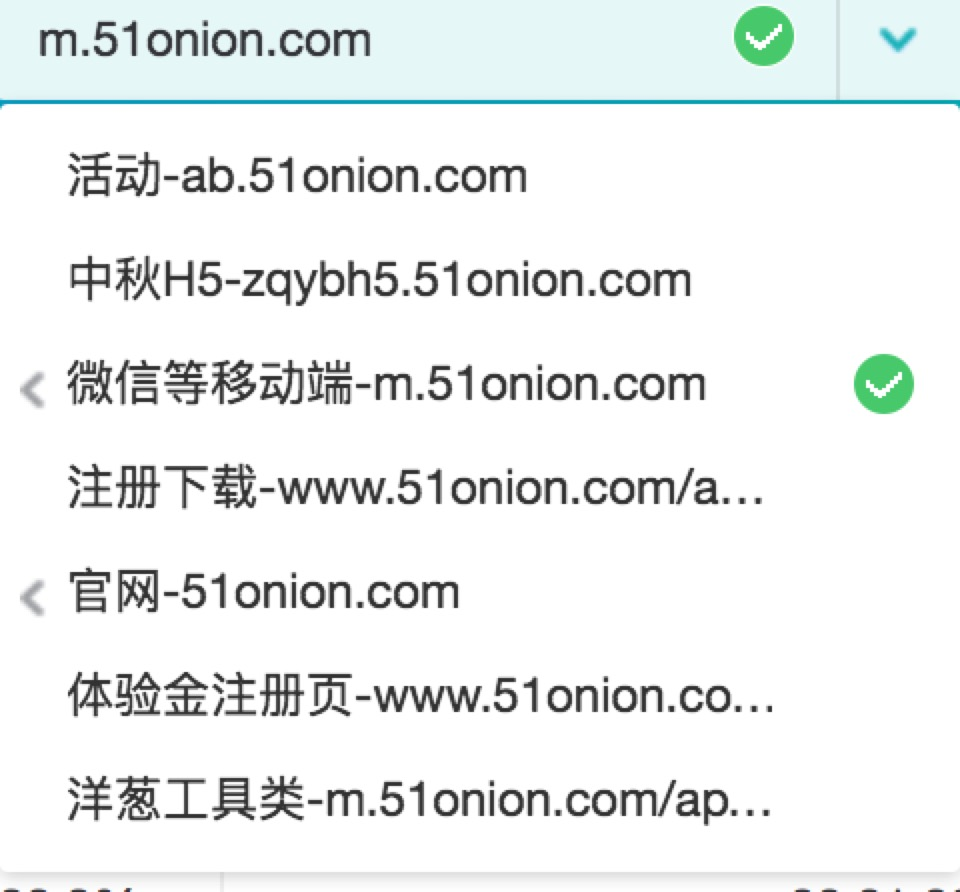

# 洋葱先生Web端交接文档--账号密码篇
### 导语：
> 2017-3-6版。

## 亚马逊AWS账号
|key|value|
|:----:|:----|
|S3地址|[https://console.amazonaws.cn/console/home?region=cn-north-1](https://console.amazonaws.cn/console/home?region=cn-north-1)|
|账号|303361436695|
|用户名|xie.sean|
|密码|(8FhBzDS4T)eATMQ|

## 微信相关
|key|账号/密码|
|:----|:----|
|洋葱先生微信公众号|rosszuo@126.com/yangcong2015|
|洋葱管家微信公众号|zuo.ross@51onion.com/yangcong2015|
|仙后座微信公众号|wu.clement@51onion.com/yangcong2015|
|微信开发者平台|dev_ios@51onion.com/51onion1001|
|微信小程序|cejako@163.com/As123456|

## 其他
|key|账号/密码|
|:----:|:----|
|百度统计|cejako/51onion1001|
|友盟|meng.red@51onion.com/al20160101|

> 百度统计中，各个站点如下：  
>  
>
* 微信端对应：**微信等移动端**站点
* PC官网对应：**官网**站点
* 体验金注册页对应：**体验金注册页**站点
* 个税计算器等工具类对应：**洋葱工具类**站点
>> 由于历史原因等，站点对应关系可能比较混乱，上面列的几个可能不完全准确，可能需要手动进入该站点查看对应的来源网站进行确认对应关系。