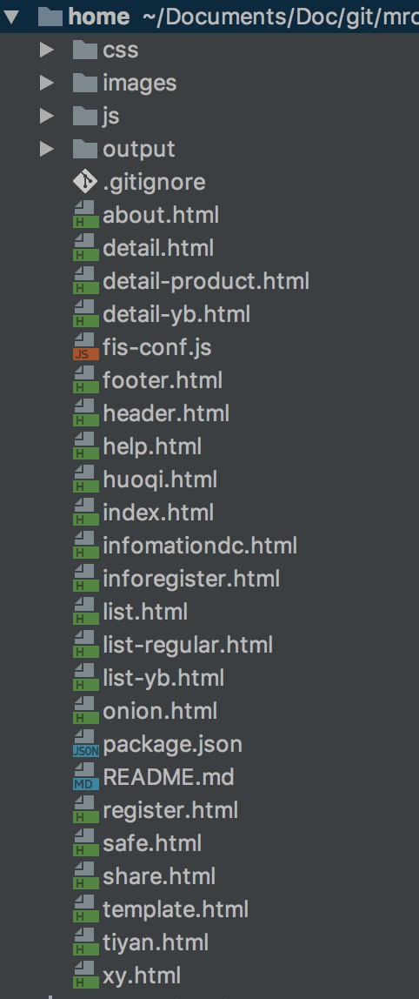
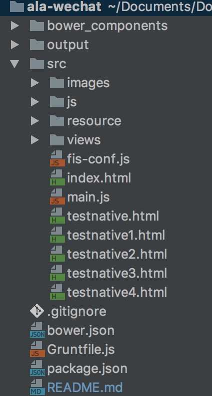
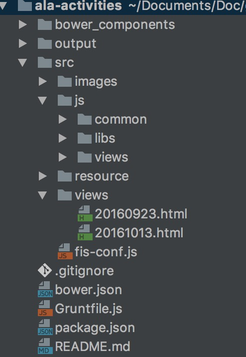
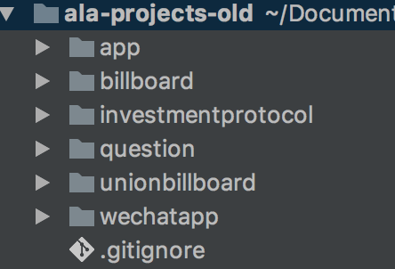
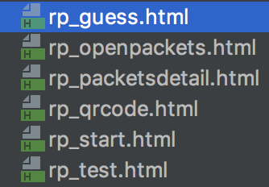
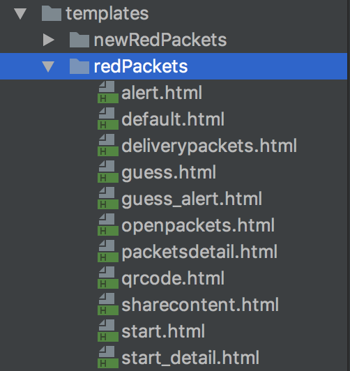
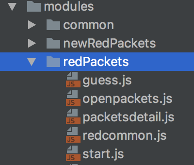
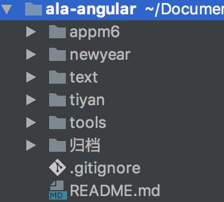

# 洋葱先生Web端交接文档--项目详情篇
### 导语：
> 2017-3-6版。现有项目基本都是基于前端本地构建的，如采用了grunt，fis3，webpack等等，所以如果要修改构建项目，电脑环境必须安装[nodejs](http://nodejs.cn/download/)以及npm(自行百度)

## 一、PC官网(home)

### 代码地址:
> git clone http://54.222.212.169/allce231/home.git

### 项目构建：
* 在`/home`路径下，执行`npm install --save-dev`，等待安装完所有的项目依赖包
* 阅读项目根目录下的`README.md`文件，最后一行的`rm -rf output && fis3 release prod -d ./output`即为构建生产环境的命令（可参考[fis3文档-发布](http://fis.baidu.com/fis3/docs/beginning/debug.html#%E5%8F%91%E5%B8%83)）
* 若要更改相应的环境，比如发布预发布环境，将上面命令中的`prod`改为`pre`即可（原因在下面会提到，在`fis-conf.js`配置文件可以发现对应配置）
* 只有在**第一次**构建的时候才需要执行`npm install`命令，因为项目所需的依赖项已经在第一次执行的时候生成了
* 上面构建命令执行完成之后，会在`/home`目录下生成`output`文件夹，该文件夹下所有内容即为发布内容，将所有文件上传至S3对应目录即可，上传方法后面统一讲到

### 文件结构：



* **`css`**: 所有的样式文件，都是以[`sass`](http://sass-lang.com/documentation/file.SASS_REFERENCE.html)语法书写的，除了`common.scss`和`index.scss`中包含的基本都是各页面的共同样式，其他文件都是根据页面来命名的
* **`images`**: 所有的图片等资源文件，也是以页面为单位拆分文件夹的
* **`js`**: 所有的脚本文件。其中，
	+ `lib`: 基本类库，如jquery等
	+ `module`: 各个共同模块化类，如`tab.js`控制各个Tab标签切换功能
	+ `view`: 每个页面的对应的模块
	
	> 采用的[requirejs](http://www.requirejs.cn/)进行模块化开发

* **`*.html`**: 页面文件，其中`header.html`为共同的头，`footer.html`为共同的底部。另外，每个文件含义分别如下：
	+ `index.html`: 首页
	+ `about.html`: 关于我们页
	+ `detail.html`: 新闻正文页
	+ `detail-product.html`: 产品信息页
	+ `detail-yb.html`: 月报页，其中**月报数据**位于*`/home/js/view/yuebaodata.js`*中，每次更新月报需在该文件中仿照原格式更新。
	+ `help.html`: 帮助页
	+ `huoqi.html`: 活期理财产品信息页
	+ `infomationdc.html`: 信息披露页
	+ **`inforegister.html`: 借款人注册页**
	+ `list.html`: 媒体中心页，**已废弃**，老版本
	+ `list-regular.html`: 媒体中心页
	+ `list-yb.html`: 月报列表页
	+ `onion.html`: 洋葱特色页
	+ `register.html`: 注册页
	+ `safe.html`: 安全保障页
	+ `share.html`: 邀请加息页
	+ `template.html`: 新闻列表页
	+ `tiyan.html`: 体验金注册页
	+ `xy.html`: 借贷合同模板页
	
	> 页面渲染模板是写在`<script type="text/template">...</script>`中，采用[`underscore`](http://underscorejs.org/)语法书写，同时脚本中通过`_.template(template)(data)`调用

* **`fis-conf.js`**: [*fis3*](http://fis.baidu.com/)的配置文件。配置含义需参考官方文档，简单来说，做了下面几个事情：
	+ 配置前面提到的`requirejs`全局配置
	+ `sass`编译成`css`以及压缩等
	+ 对`js`,`css`文件进行合并等
	+ 配置了多套环境分别对应的配置参数，根据不同的环境编译不同的版本，如前面提到的执行预发布环境发布命令`fis3 release `**`pre`**` -d ./output`，
		- `debug`: 开发环境
		- `test`: test1环境
		- `pre`: 预发布环境
		- `prod`: 生产环境
	
	> 针对预发布和生产环境，对构建代码配置了`hash`，即最终文件会被编译成 `[file]_md5.*`的名字，同时，无需担心`html`等文件中对应的文件引用错误，fis3会自动帮我们解决这个问题。
	
	> 同时，对于图片，脚本，样式等资源文件，添加了`domain`配置，是因为我们生产环境使用了**`CDN`**，运维对我们的的特定域名做了`CDN`配置，对应也有两套环境：
	>> * **预发布环境**： `http://preimage.51onion.com`
	>> * **生产环境**：`http://image.51onion.com`
	
* `README.md`: 一些基本命令提示，不是很完整
* `package.json`: 项目依赖配置文件
* `.gitignore`: git提交忽略文件配置

> **PC端更新月报步骤：**
>> + 将图片复制至`/home/images/yuebao/`目录下
>> + 修改`/home/js/view/yuebaodata.js`文件，按照固定格式修改
>> + 在`/home`路径下执行`rm -rf output && fis3 release prod -d ./output`命令
>> + 将新生成的`output`里面的所有文件上传至S3即可

> **PC端常见问题**
>> + PC官网中的[常见问题页](http://www.51onion.com/help.html)，其中里面的问题和答案截止3.4版本，都是从js文件中读取的，并非直接写死在html文件中，这点要**特别注意**
>> + js文件路径为下面**第四部分**项目中的`question`模块，具体路径为`/ala-projects-old/question/www/res/js/questionsdata.js`


## 二、移动站点(微信服务号:ala-wechat)
### 代码地址:
> git clone http://54.222.212.169/cejako/ala-wechat.git

### 项目构建：
* 同上，如`README.md`文件所述，在`/ala-wechat`路径下，执行：
	+ `npm install --save-dev`
	+ `grunt`
	+ `cd src`
	+ `fis3 release prod -d ../output`
* 只有在**第一次**构建的时候才需要执行前面两个命令，因为项目所需的依赖项已经在第一次执行的时候生成了
* 执行以上命令之后会在根目录下生成`output`文件夹，即为发布内容

### 文件结构：



* `bower_components`: bower安装之后的项目依赖文件，具体参照`bower.json`文件
* `bower.json`: 项目的一部分依赖第三方类库是采用`bower`来安装的，如`angular`，`fastclick`等
* `Gruntfile.js`: grunt的配置文件，主要利用grunt做了两个事情：
	+ `bower install --save-dev`: 执行bower依赖安装
	+ `bower copy`: 将上一步安装的第三方依赖项复制至`/src/js/libs`文件夹下
* `README.md`: 一些基本命令提示
* `package.json`: 项目依赖配置文件
* `.gitignore`: git提交忽略文件配置
* **`src`**: 项目源文件目录
	+ `images`: 图片资源文件，按业务分成对应的文件夹
	+ `resource`: css, sass等样式文件，其中按业务分成几块：
		- `main.scss`: 共同样式等
		- `animation.scss`: 动画相关等样式
		- `home.scss`: 首页页面样式
		- `fixed.scss`: 定期页面样式
		- `account.scss`: 账户页面样式
		- `uoion.scss`: 联盟页面样式
		- `user.scss`: 用户设置等页面样式
		- `register.scss`: 注册页等页面样式
		- `updatenotice.scss`: 用户设置新浪支付通知，更改银行限额等页面样式
		
	+ `views`: 所有的页面模板，同前面`sass`文件说明，按业务分成了五大类，以及一些注册登录等页面。（页面太多，不一一详细列出了）
	+ `js`: 所有的脚本文件，其中：
		> 该项目采用的是`angular 1.x`，总体架构是一个SPA(单页应用)，结合`requirejs`进行模块化开发。
		
		- **`app.js`**: **程序入口文件，为该框架架构的核心，主要做了几个事情：**
			* 配置一些基本的`provider`
			* 声明整个单页应用的路由机制，并实现了根据路由动态加载页面需要的`html,js,css`文件
			* 实现页面转场时，添加前进后退动画
			* 自动弹出loading加载动画
			
		- `routes.js`: 路由配置文件
		- `bdanalysis.js`: 百度统计代码，**注意每个项目对应的统计ID都是一一对应的**
		- `libs`: 项目依赖的类库
		- `controller`: 所有页面的控制层，跟前面的`views`页面文件一一对应，具体方式得参考[`angular controller`](https://docs.angularjs.org/guide/controller)
		> 简单来说，就是在`controller`中，绑定一些事件在`$scope`对象上，如
		```javascript
		$scope.showTab = function () {
            console.log(arguments);
        }
		```
		，将在`html`页面，指定调用改方法即可，如
		```html
		<li ng-click="showTab(1)">红包</li>
		```
		- `directives`: 自定义的一些指令，如`topTip`：页面顶部的小提示框。具体方式得参考[`angular directive`](https://docs.angularjs.org/guide/directive)
		- `filters`: 自定义的一些过滤器，如`money`：金额显示两位小数。具体实现方式得参考[`angular filter`](https://docs.angularjs.org/api/ng/filter/filter)
		- `services`: 也是利用angular的`service`模块定义的一些单例实例，如
			* 基本共通类`Utility`，包含了各种共通的方法，比如`ajax`请求：`Utility.ajax()`
			* 微信相关操作类`WxManager`，包含各种微信公众号涉及到的相关功能
			* 本地存储类`Storage`，本地存储功能
			* 金融业务嘞`Finance`，部分金融业务相关功能，比如计算预期收益：`Finance.calExpectReturn()`
			
		- `view`: 下面只有`yuebao.js`，为月报页面提供数据，**更新月报，需按格式修改该文件**
	+ `fis-conf.js`: fis3的构建配置文件，同PC官网说明，基本配置一致
	+ `index.html`: 单页应用的入口`index`文件，所有的页面跳转都是通过对应路由对应`controller`渲染对应模板到`<div class="view" ng-view></div>`节点中来实现画面更新的。
	+ **`main.js`**: **程序启动文件，无须理会**
	+ `testnative*.html`: 当初测试跟native交互协议的测试页面，也无须理会
	
> **微信端更新月报步骤：**
>> + 将图片复制至`/ala-wechat/src/images/yuebao/`目录下
>> + 修改`/ala-wechat/src/view/yuebao.js`文件，按照固定格式修改
>> + 在`/ala-wechat/src`路径下执行`rm -rvf ../output && fis3 release prod -d ../output`命令
>> + 将新生成的`output`里面的所有文件上传至S3即可

## 三、活动页（ala-activities）
### 代码地址:
> git clone http://54.222.212.169/cejako/ala-activities.git

### 项目构建：
* 同上，如`README.md`文件所述，在`/ala-wechat`路径下，执行：
	+ `npm install --save-dev`
	+ `grunt`
	+ `cd src`
	+ `fis3 release prod -d ../output`
* 只有在**第一次**构建的时候才需要执行前面两个命令，因为项目所需的依赖项已经在第一次执行的时候生成了
* 执行以上命令之后会在根目录下生成`output`文件夹，即为发布内容

### 文件结构：



> 跟微信移动站点项目类似的目录结构，也都是`requirejs`进行模块化开发，`fis3`进行项目构建，不同之处在于项目不是采用`angular 1.x`，因为每个活动页面独立，基本都采用比较传统的`jquery(移动端，所以用的zepto)`方式，以及个别页面采用的`react`。**不过这些都不重要，因为活动页具有太强的实效性，现已基本过期或不再需要维护，所以可以忽略该项目，后续有新的活动需要开发，可自行决定如何开发**

## 四、老项目汇总，如常见问题（ala-project-old）
### 代码地址:
> git clone http://54.222.212.169/cejako/ala-projects-old.git

### 项目构建：
* 该项目下的各个小项目的构建方式不同于前面几个，项目技术点只是简单的使用了`requirejs`而已，同时，简单的利用它自带的模块化工具来进行压缩和模块化处理。
* 全局安装[`r.js`](http://requirejs.org/docs/optimization.html#download)
* 在对应的目录下(比如`/ala-projects-old/question`)运行`r.js -o tools/build.js`
* 然后会在该目录下生成`www-built`文件夹，将该文件夹内的内容上传至对应的S3目录即可
* 你会发现该项目下的小项目基本都保持同样的目录结构，同时也基本都共用该构建方法，都是如下目录结构
	+ `tools/build.js`: 构建配置文件，基本都是相同的，里面需要手动指定`serverUrl`的值，代表不同环境的服务器地址
	+ `www`: 源代码文件
	+ `www-built`: 项目构建之后生成的文件夹，里面的内容即为上传至服务器的内容，由于已经被我添加进`.gitignore`文件，故不会被上传到git远程仓库

### 文件结构：



> 该项目实际上应该是多个小项目的集合，对应不同的业务，有些现已不在用到，可以不用理会

* `app`: 原APP内部分静态页对应的地址，历史版本中存在，现版本已没有对应的页面，**可以忽略，无须理会**
* `billboard`: 排行榜，现在的APP内以及微信版中的排行榜指的都是该项目，目录结构同上面统一所述。一般情况该项目不太会修改。
* `unionbillboard`: 联盟排行榜，跟排行榜完全类似。
* **`investmentprotocol`**: 投资服务协议，现在的APP内以及微信版中的投资服务协议指的都是该项目，可能会频繁修改。目录结构同样如上所述，只需修改里面的`index.html`文件即可，修改方式很简单，直接增删改里面的`<p></p>`节点内文本即可。
* **`question`**: **常见问题页**。需重点关注该部分，移动端(APP和微信版)的常见问题指的就是该项目，可能会频繁修改。
	+ 修改`ala-projects-old/question/www/res/js/questionsdata.js`文件即可
	+ 该文件分成两部分，对应常见问题页的两页，
		- `tags`: 配置了第一页的大类已经对应的icon
		- `questions`: 配置了第二页的具体问题和答案，PC官网读取的即是这部分内容
	+ 其他文件一般情况不需要修改，除非更改页面样式逻辑等
	+ 修改该文件之后，**PC官网的常见问题页也会随之更改**，因为它读取的就是该文件，前面第一部分的最后有提到。
* `wechatapp`: 原来老版本的微信服务号，采用的前端技术跟当前微信服务号(前面第二部分)不同，也只是简单的使用了`requirejs`而已，
	+ 只有**红包页**现在还在使用，其他页面都已经没有入口了，所以只需关心红包相关的即可
	+ 红包页面部分，为`views`和`templates`文件夹下对应的，如下图所示：
	
	
	+ 红包`js`部分，为`modules/redPackets`文件夹下对应的，如下图所示：
	
	+ 构建方式为上面所述的通用构建方式
	
## 五、仙后座项目(ala-cassiopeia)
### 代码地址:
> git clone http://54.222.212.169/cejako/ala-cassiopeia.git

### 项目构建：
* 该项目采用`vuejs`和`ES6`语法书写，项目构建也跟前面的都不同，采用的是目前前端比较新比较火的`webpack`来进行构建的
* `npm install --save-dev`，安装项目依赖
* `grunt`，会安装`bower`依赖
* `rm -rvf ./output && NODE_ENV=prod webpack --config webpack.config.js`，应用webpack进行构建，并需要指定环境参数，具体可查看`webpack.config.js`文件
* 同样地，会生成`output`文件夹，上传里面内容至S3即可

> 由于该项目现在已废弃，可以忽略，聊作代码参考而已，已无其他意义，故不赘述了。

## 六、其他项目汇总(ala-angular)
> 改项目下的基本都是原来Hanson负责的内容，比如体验金注册页，正常注册页(现已基本没有被投放了)等

### 代码地址:
> git clone http://54.222.212.169/cejako/ala-angular.git

### 文件结构：



* `appm6`: 这个为APP内的邀请好友加息页面。构建方式跟PC官网项目基本一致，只是需要多一步操作，
	+ 执行`npm install --save-dev`，安装gulp等依赖项目
	+ 执行`gulp watch`
	+ 执行`rm -rvf output && fis3 release -d ./output`
	+ 将生成的`output`文件夹内内容上传至S3即可
* `newyear`: 新年活动项目，已过期，可忽略
* `text`: 一些给运营临时写的，已经失效的静态通知或消息页面，可忽略
* `tiyan`: 体验金注册页，构建方式跟前面的`appm6`项目完全一样
* `tools`: 一些小工具，比较简单，无需构建，修改直接源文件上传即可
	+ `index.html`: 根据指定渠道生成体验金注册页地址小工具
	+ `gsjsq.html`: 个税计算器
* `归档`: 各种杂七杂八的历史项目，大概率下不会再需要这些文件

## 七、SEO原型(ala-seo)，移动SEO原型(ala-seo-mobile)
> 分别是SEO对应的前端原型，只是包含了`html`,`css`,`js`文件，并且，**这些文件只具有参考价值，现在线上的代码可能跟这些不一致**，因为SEO项目主要是后台将这些原型页面填充数据之后的，已经在此基础上进行过大幅度的修改，**不可直接拿这些文件进行替换**。

### 代码地址:
> git clone http://54.222.212.169/cejako/ala-seo.git

> git clone http://54.222.212.169/cejako/ala-seo-mobile.git